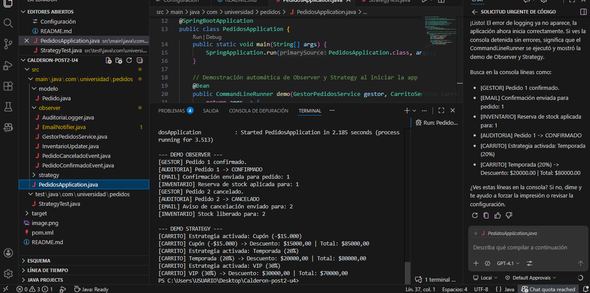
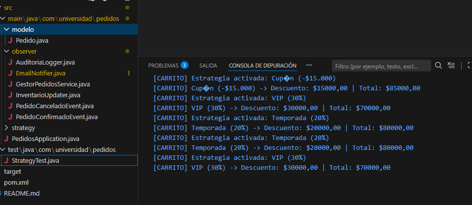

# Sistema de Pedidos — Observer y Strategy

Este proyecto implementa dos patrones de diseno usando Spring Boot:

- **Observer**: Notificaciones automaticas por eventos de pedido (confirmacion/cancelacion) usando ApplicationEvents y `@EventListener`.
- **Strategy**: Motor de descuentos intercambiables en el carrito de compras, seleccionable en tiempo de ejecucion.

## Estructura del proyecto

- `observer/` — Eventos, publicador y suscriptores (email, inventario, auditoria)
- `strategy/` — Estrategias de descuento y servicio de carrito
- `modelo/Pedido.java` — Entidad de pedido

## Funcionamiento

### Observer (Eventos de Pedido)
1. `GestorPedidosService` confirma o cancela un pedido.
2. Se publica un evento (`PedidoConfirmadoEvent` o `PedidoCanceladoEvent`).
3. Los suscriptores (`EmailNotifier`, `InventarioUpdater`, `AuditoriaLogger`) reaccionan automaticamente via `@EventListener`.

### Strategy (Motor de Descuentos)
- `CarritoService` recibe todas las estrategias de descuento disponibles.
- Se puede activar una estrategia por nombre en tiempo de ejecucion.
- El calculo del total se delega a la estrategia activa.
- Agregar una nueva estrategia solo requiere crear un nuevo `@Service` que implemente `EstrategiaDescuento`.

## Ejemplo de ejecucion de la aplicacion

Al iniciar la aplicacion, se muestra en consola:

```

--- DEMO OBSERVER ---
[GESTOR] Pedido 1 confirmado.
[EMAIL] Confirmacion enviada para pedido: 1
[INVENTARIO] Reserva de stock aplicada para: 1
[AUDITORIA] Pedido 1 -> CONFIRMADO
[GESTOR] Pedido 2 cancelado.
[EMAIL] Aviso de cancelacion enviado para: 2
[INVENTARIO] Stock liberado para: 2
[AUDITORIA] Pedido 2 -> CANCELADO

--- DEMO STRATEGY ---
[CARRITO] Estrategia activada: Temporada (20%)
[CARRITO] Temporada (20%) -> Descuento: $20000.00 | Total: $80000.00
[CARRITO] Estrategia activada: VIP (30%)
[CARRITO] VIP (30%) -> Descuento: $30000.00 | Total: $70000.00
[CARRITO] Estrategia activada: Cupon (-$15.000)
[CARRITO] Cupon (-$15.000) -> Descuento: $15000.00 | Total: $85000.00
```

## Ejemplo de ejecucion de pruebas unitarias

```sh
mvn test
```




Los tests de `StrategyTest` y `ObserverTest` validan:
- Calculo correcto de descuentos
- Cambio de estrategia en tiempo de ejecucion
- Manejo de estrategias invalidas
- Publicacion y reaccion a eventos Observer

## Requisitos
- Java 17+
- Maven 3.8+
- Spring Boot


